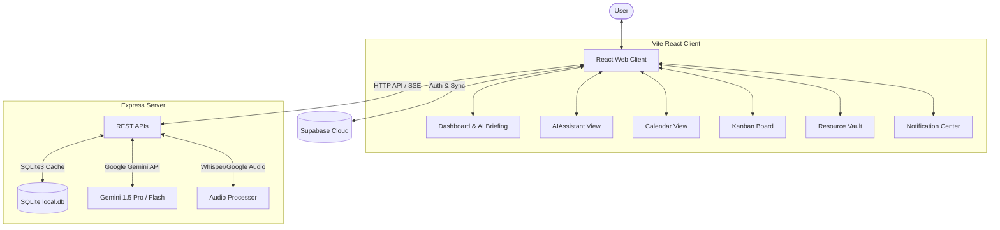

# RemindMeUp — Premium AI Task Assistant & Reminder Hub

RemindMeUp is a premium, Notion-inspired AI productivity platform featuring a voice-enabled scheduling assistant, dynamic calendar grids, robust Kanban boards, an AI Daily Briefing dashboard, and real-time interactive notifications. It is powered by a high-performance React client and an Express+SQLite backend backed by Supabase Auth and the Google Gemini API.

---

## 🌟 Key Product Views & Capabilities



### 1. Unified Dashboard (`DashboardView.tsx`)
* **AI Daily Briefing:** Leverages the Gemini API to analyze active tasks and construct a custom-tailored morning productivity briefing and weather analysis.
* **Notification Dropdown:** Click the Bell icon in the header to access the absolute-positioned interactive alerts dropdown. Track unread items, complete tasks with inline actions, and dismiss alerts in real-time.

### 2. Intelligent AI Assistant (`AIAssistantView.tsx`)
* **Hinglish & English Vocal Parser:** Multi-lingual voice processing automatically transcribes audio files to understand scheduling requests in both formal English and casual Hinglish (e.g. *"June 29th ko review meeting rakh do"*).
* **Gemini Function Calling Architecture:** Uses official Google `@google/generative-ai` tool interfaces for precision extraction of task metadata (`title`, `date`, `time`, `priority`, `category`).
* **Chat History Persistence:** Automatically serializes conversational threads to SQLite/Supabase to restore chat logs seamlessly.

### 3. Notion-Inspired Kanban Workspace (`KanbanView.tsx`)
* **Drag-and-Drop Columns:** Group tasks by standard status lanes (`To-Do`, `In Progress`, `Done`) or priority categories.
* **Custom Project Workspaces:** Create custom project boards directly from the side drawer for isolated workspaces.

### 4. Interactive Calendar (`CalendarView.tsx`)
* **Dynamic Month Grid:** Seamlessly render task grids, high-risk flags, AI-predicted items, and overdue warnings directly inside calendar day cells.
* **Daily Quick Add Dialog:** Click on any calendar cell to trigger the modal pre-filled with the selected calendar date.

---

## 📁 System Directory Map

```text
remindMeUp/
├── backend/                       # REST APIs and AI Logic Server
│   ├── server.js                  # Main server execution logic
│   ├── .env.example               # Template environment configuration
│   ├── .env                       # Local secrets (ignored in Git)
│   └── package.json               # Backend dependencies
├── frontend/                      # React SPA Client
│   ├── src/
│   │   ├── main.tsx               # Client entrypoint
│   │   ├── App.tsx                # Routing, notifications, global states
│   │   ├── index.css              # Custom styling tokens and global styles
│   │   ├── lib/
│   │   │   └── supabaseClient.ts  # Client supabase initializer
│   │   └── components/
│   │       ├── DashboardView.tsx  # Header widgets, Briefing banner, Bell dropdown
│   │       ├── AIAssistantView.tsx# Mic recorder, persistent chat, parsing engine
│   │       ├── CalendarView.tsx   # Interactive scheduling grid
│   │       ├── KanbanView.tsx     # Notion-inspired workspace boards
│   │       ├── ResourceVaultView.tsx # Local references library
│   │       ├── Sidebar.tsx        # Dynamic side navigation drawer
│   │       ├── LoginView.tsx      # Secure Supabase Auth container
│   │       └── QuickAddModal.tsx  # Interactive task creator (NLP-enabled)
│   ├── vite.config.ts             # Vite build settings
│   └── package.json               # Frontend dependencies
└── README.md                      # System manual
```

---

## 🚀 Quick Setup & Installation

### Prerequisite Environment Keys

Create a `.env` file in the `backend/` directory based on `backend/.env.example`:
```env
PORT=4000
SUPABASE_URL=https://your-project.supabase.co
SUPABASE_JWT_SECRET=your-jwt-signing-key
GEMINI_API_KEY=AIzaSy...
```

### Steps to Run

1. **Start the Backend Server:**
   ```bash
   cd backend
   npm install
   node server.js
   ```

2. **Start the Frontend client:**
   ```bash
   cd frontend
   npm install
   npm run dev
   ```

3. Open your browser and navigate to `http://localhost:5173/` to enjoy the premium AI assistant experience!
